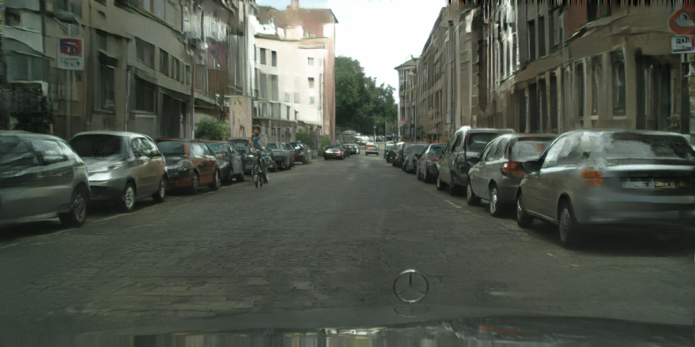
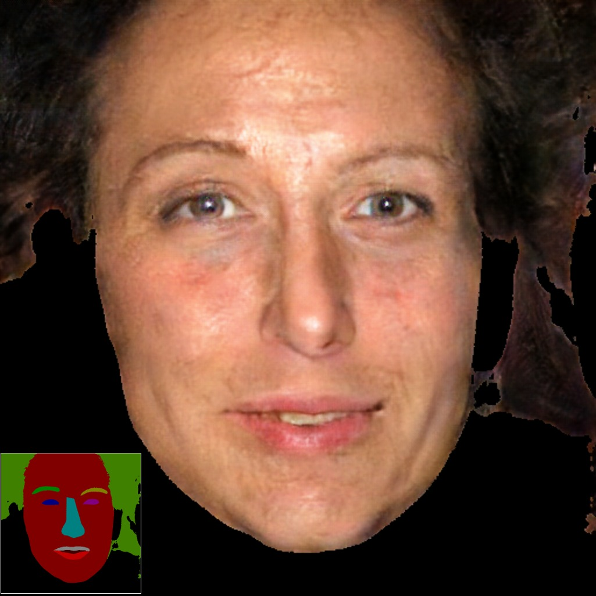

<br><br><br><br><br><br>

# pix2pixHD

Pytorch implementation for high-resolution (e.g. 2048x1024) photorealistic image-to-image translation, for example, turning semantic label maps into photo-realistic images, or synthesizing portraits from face label maps. <br><br>

## image-to-image translation at 2k/1k resolution
- Our label-to-streetview results
<p align='center'>  
  
  
</p>
- Interactive editing results
<p align='center'>  
  
  
</p>
- Additional streetview results
<p align='center'>
  
  
</p>
<p align='center'>
  
  
</p>

- Label-to-face and interactive editing results
<p align='center'>
  
  
  
</p>
<p align='center'>
  
  
  
</p>

- Our editing interface
<p align='center'>
  
  
</p>

## Prerequisites
- Linux or macOS
- Python 2 or 3
- NVIDIA GPU (12G or 24G memory) + CUDA cuDNN

## Getting Started
### Installation
- Install PyTorch and dependencies from http://pytorch.org
- Install Torch vision from the source.
```bash
git clone https://github.com/pytorch/vision
cd vision
python setup.py install
```
- Install python libraries [dominate](https://github.com/Knio/dominate).
```bash
pip install dominate
```
- Clone this repo:
```bash
git clone https://github.com/tcwang0509/pix2pixHD
cd pix2pixHD
```

### Dataset
- We use the Cityscapes dataset. Some examples images are included in the `datasets` folder.
To train on the full dataset, please download it from the [official website](https://www.cityscapes-dataset.com/) (registration required).
After downloading, please put it under the `datasets` folder in the same way the example images are provided.

### training
- Train a model at 1024 x 512 resolution (`bash ./scripts/train_512p.sh`):
```bash
#!./scripts/train_512p.sh
python train.py --name label2city_512p
```
- To view training results and loss plots, please see tensorboard logs in `./checkpoints/label2city_512p/logs`. To see more intermediate results, check out  `./checkpoints/label2city_512p/web/index.html`

### multi-GPU training
- Train a model using multiple GPUs (`bash ./scripts/train_512p_multigpu.sh`):
```bash
#!./scripts/train_512p_multigpu.sh
python train.py --name label2city_512p --pool_size 1 --batchSize 8 --gpu_ids 0,1,2,3,4,5,6,7
```
Note: this is not tested and we trained our model using single GPU only. Please use at your own discretion.

### training at full resolution
- To train the images at full resolution (2048 x 1024) requires a GPU with 24G memory (`bash ./scripts/train_1024p_24G.sh`).
If only GPUs with 12G memory are available, please use the 12G script (`bash ./scripts/train_1024p_12G.sh`), which will crop the images during training. Performance is not guaranteed using this script.

### Testing
- Please download the pretrained model from [here](https://drive.google.com/file/d/1h9SykUnuZul7J3Nbms2QGH1wa85nbN2-/view?usp=sharing) (google drive link), and put it under `./checkpoints/label2city_1024p/`
- Test the model (`bash ./scripts/test_1024p.sh`):
```bash
#!./scripts/test_1024p.sh
python test.py --name label2city_1024p --phase test --how_many 15 --netG local --ngf 32 --resize_or_crop none
```
The test results will be saved to a html file here: `./results/label2city_1024p/test_latest/index.html`.

More example scripts can be found at `scripts` directory.

## Training/test Details
- Flags: see `options/train_options.py` and `options/base_options.py` for all the training flags; see `options/test_options.py` and `options/base_options.py` for all the test flags.
